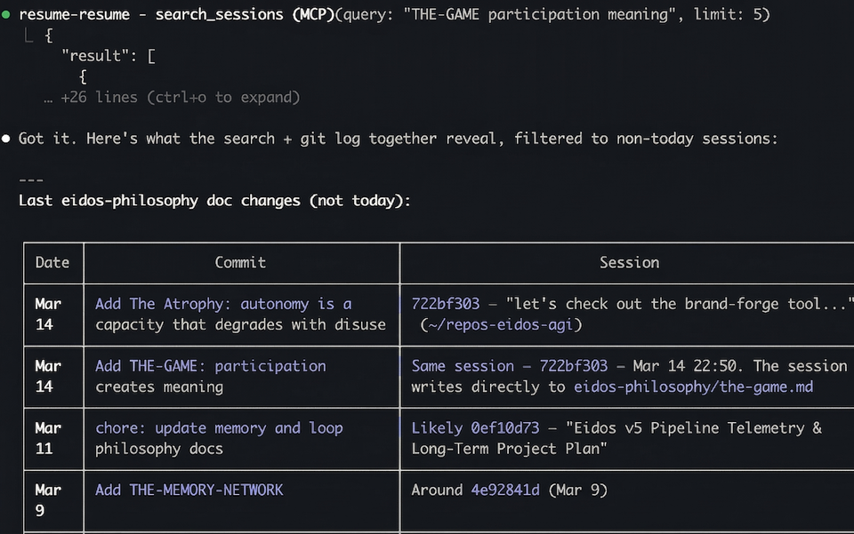
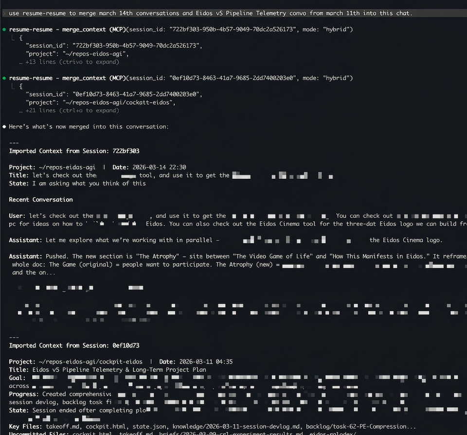

<p align="center">
  
</p>

# claude-resume

**New free tool we're dropping.**

| | |
|---|---|
| **Resume** | Ask Claude Resume to find old programming sessions in plain English, and pick up where you left off. |
| **Prioritize** | Claude Resume auto-ranks your past chats based on recency and incomplete worktrees, so you don't leave important work unfinished or uncommitted. |
| **Speed** | Claude Resume uses parallelized search to look through gigabytes of past chats in seconds. |
| **Cost Savings** | Claude Resume uses Haiku (smallest Claude model) to summarize past context once, then caches it permanently — so after the first run, searching thousands of sessions costs nothing. |
| **Merge** | Ask Claude Resume to merge multiple old chats together, pulling your thoughts across sessions into a single conversation. |

A terminal UI + MCP server that finds your recently active Claude Code sessions, tells you what each one was doing, and gets you back to work fast — or lets Claude search and reason over your full session history.

## The Problem

Your Mac kernel panics mid-session. You reboot. You had three Claude Code sessions open across different projects. Which ones? What were they doing? Where did they leave off?

Claude Code stores session data in `~/.claude/projects/` as JSONL files, but good luck browsing thousands of sessions to find the three that matter.

## What This Does

Two things, independently useful:

1. **TUI** — A terminal interface for crash recovery. Launches instantly, shows recent sessions with AI summaries, lets you arrow to the one you want and hit `r` to resume.
2. **MCP server** — Gives Claude (or any MCP client) tools to search, read, and reason over your full session history. "Find the session where we built the auth middleware." It searches 5,000+ sessions in ~3 seconds.

```
┌─ claude-resume ─────────────────────┬──────────────────────────────────────┐
│ ── Today ──                         │ Fix auth token refresh bug           │
│ ❱ Fix auth token refresh bug        │                                      │
│   ~/repos/myapp  12 minutes ago     │ Directory:   ~/repos/myapp           │
│                                     │ Last active: 12 minutes ago          │
│   Add dark mode to settings page    │ Size:        4.2 MB                  │
│   ~/repos/frontend  2 hours ago     │                                      │
│                                     │ Session stats:                       │
│ ── Yesterday ──                     │   Duration:     1h 23m               │
│   Refactor database migrations      │   User msgs:    47                   │
│   ~/repos/backend  18 hours ago     │   Tool uses:    312                  │
│                                     │                                      │
│                                     │ Goal:                                │
│                                     │ Fix the auth token refresh that was  │
│                                     │ silently failing after 401 responses │
│                                     │ from the /api/user endpoint.         │
│                                     │                                      │
│                                     │ Where you left off:                  │
│                                     │ Mid-edit in auth/refresh.ts. The     │
│                                     │ retry logic was added but the test   │
│                                     │ for expired tokens was still failing │
│                                     │ with a race condition.               │
│                                     │                                      │
│                                     │ Key files:                           │
│                                     │   • src/auth/refresh.ts              │
│                                     │   • tests/auth.test.ts               │
│                                     │   • src/api/client.ts                │
└─────────────────────────────────────┴──────────────────────────────────────┘
```

## Examples

We built **Eidos**, a multi-agent AI system. In [our benchmark](https://github.com/eidos-agi/cockpit-eidos), Eidos outperformed **Claude Opus 4.6** by **3.6x** in both accuracy and speed on complex tasks with 15+ reasoning chains. Below, we use Claude Resume to pick up where we left off across multiple sessions.

### Finding the benchmark where Eidos beat Claude Opus 4.6

> *"use claude-resume to find the eidos test where we beat claude"*


Claude Resume searches 5,000+ sessions in ~3 seconds and surfaces the exact session — including the snippet showing the 3.6x outperformance result.

### Searching for a past session in plain English

> *"use claude-resume to find the latest chats about eidos philosophy docs"*



### Merging multiple past sessions into this chat

> *"use claude resume to merge march 14th conversations and Eidos v5 Pipeline Telemetry convo from march 11th into this chat"*



Two sessions — one about eidos-philosophy doc changes (Mar 14) and one with the full 28-task strategic plan (Mar 11) — merged into the current conversation with a single command.

## Install

```bash
git clone https://github.com/eidos-agi/claude-resume
cd claude-resume
pip install -e .
```

This puts `claude-resume` and `claude-resume-mcp` on your PATH. Since it's an editable install (`-e`), pulling updates from the repo takes effect without reinstalling.

Requires Python 3.11+ and [Claude Code](https://docs.anthropic.com/en/docs/claude-code) (uses `claude -p` for AI summaries).

## TUI Usage

```bash
claude-resume            # Sessions from last 4 hours
cr                       # Short alias
claude-resume 24         # Last 24 hours
claude-resume --all      # Everything
claude-resume --cache-all  # Pre-index all sessions (background, slow)
```

### Keyboard Shortcuts

| Key | Action |
|-----|--------|
| `↑` `↓` | Navigate sessions |
| `r` | Resume directly — exec into the session, no clipboard |
| `Enter` | Copy resume command to clipboard |
| `Space` | Select/deselect for multi-resume |
| `x` | Export context briefing as markdown to clipboard |
| `→` `←` | Scroll preview pane |
| `/` | Search across all session content |
| `d` | Toggle `--dangerously-skip-permissions` |
| `D` | Deep dive — longer, more detailed summary |
| `p` | Patterns — analyze your prompting habits |
| `b` | Toggle automated/bot sessions |
| `Esc` | Quit |

## MCP Server

The MCP server lets Claude search and reason over your session history directly from a conversation. Add it to your Claude Code MCP config:

```json
{
  "mcpServers": {
    "claude-resume": {
      "command": "claude-resume-mcp"
    }
  }
}
```

Or launch it manually:

```bash
claude-resume-mcp
```

### MCP Tools Reference

#### `boot_up(hours=24)`
**Crash recovery.** Finds sessions that were recently active but didn't exit cleanly — crashed terminals, killed processes, laptop sleep/restart. Returns a prioritized list scored by urgency (recency + dirty files). Use this after a reboot or "what was I working on?" moment.

```
{total: 3, running: 1, checked: 47, sessions: [...]}
```

#### `recent_sessions(hours=24, limit=10)`
List recently active sessions. Simple — project path, date, and cached title for each. Resume any with `claude --resume <id>`.

#### `search_sessions(query, limit=10)`
**Full-text search across all sessions** (~3s for 5,000+ sessions). Uses AND logic for multi-word queries, supports quoted phrases for exact matches.

Ranked by a multi-signal Reciprocal Rank Fusion score:
- **Term frequency** — how often the terms appear (with diminishing returns)
- **Term density** — matches per KB (favors focused sessions over large dumps)
- **Recency** — exponential decay with 30-day half-life
- **Term balance** — penalizes sessions strong in one query word but weak in others
- **Title boost** — 3x weight if terms appear in the cached session title

Returns each result with a contextual snippet showing where the match occurs.

```python
search_sessions("auth middleware jwt")           # AND: all three must appear
search_sessions('"token refresh" race condition') # Exact phrase + word
search_sessions("eidos benchmark", limit=5)
```

#### `read_session(session_id, keyword="", limit=10)`
Read user/assistant messages from a session. Returns head + tail for quick context. Optional keyword filter narrows to only matching messages.

#### `session_summary(session_id, force_regenerate=False)`
Get or generate an AI summary for a session. Returns instantly from cache if available. If not cached, queues to the background daemon (~15s) or generates synchronously (~30s fallback).

Summary includes: title, goal, what was done, state, key files, decisions made, next steps.

#### `merge_context(session_id, mode="hybrid", keyword="", message_limit=6)`
**Import context from another session into this one.** Use this to pull research, decisions, or progress from a previous session without copy-pasting.

Modes:
- `"summary"` — AI summary only (~1-2k tokens). Fast, compact.
- `"messages"` — Head+tail user/assistant messages (~1-5k tokens). Richer.
- `"hybrid"` — Summary + last few messages (~2-4k tokens). Best default.

Returns a formatted markdown context block ready for Claude to consume directly.

#### `session_timeline(session_id, limit=50, focus="recent", after="", before="")`
**Structured timeline of milestones** from a session — file creates/edits, git commits, user instructions, and significant tool calls. Solves the "black box" problem for long sessions: understand what happened in a 2,000-message session without reading every message.

Focus options:
- `"recent"` — 70% tail + 30% head. Best for "where did we leave off?"
- `"even"` — Evenly spaced across the full session. Best for the whole arc.
- `"full"` — Most recent events first, no sampling.

Supports `after`/`before` ISO timestamp filters.

#### `session_thread(session_id)`
**Follow continuation links** to reconstruct a multi-session thread. When sessions are continued via merge_context or bookmarks, traces the chain and returns all linked sessions in chronological order. Use when you suspect work spans multiple sessions.

#### `resume_in_terminal(session_id, fork=False)`
Open a session in a new terminal window (macOS only). Tries iTerm2 first, falls back to Terminal.app. With `fork=True`, creates a new session with the full conversation history — like `git branch` for sessions.

### Data Science Tools

A second set of tools for analyzing your session history at scale.

#### `session_insights(section="all", max_sessions=0)`
Deep analytics on all your Claude Code sessions. First call takes 30-60s (parses JSONL files); subsequent calls are cached.

Sections: `overview`, `temporal`, `projects`, `tools`, `models`, `records`, `predictions`, `personality`, `fun_facts` — or `all` for everything.

Surfaces patterns like peak productivity hours, most-used tools, your "coding personality," streaks, and predictions about your habits.

#### `session_xray(session_id)`
Deep single-session breakdown — duration, tool call counts, token usage, conversation branches, edit/revert patterns, everything.

#### `session_report(output_path="", org="")`
Generate a full analytics report as an HTML or markdown file.

#### `session_data_science(query)`
Natural language interface for ad-hoc queries over your session history. Ask anything — the tool routes to the right analytics functions.

## Session Bookmarks

By default, claude-resume infers session state from AI summaries — it guesses whether you finished, crashed, or got stuck. Bookmarks replace guessing with ground truth.

Run `/bookmark` inside any Claude Code session before you close it. It captures:

- **Lifecycle state** — done, paused, blocked, or handing off
- **Next actions** — what you (or the next person) should do first
- **Blockers** — what's preventing progress
- **Confidence** — how stable the current state is
- **Workspace snapshot** — git status, uncommitted files, current branch

Bookmarked sessions show a colored badge in the TUI list:

| Badge | Meaning |
|-------|---------|
| `DONE` (green) | Work is complete |
| `PAUSED` (yellow) | Intentional stop, will return |
| `BLOCKED` (red) | Can't proceed, external dependency |
| `HANDOFF` (cyan) | Someone else is taking over |
| `AUTO` (dim) | Session closed without explicit bookmark |

The preview pane shows bookmark data — next actions, blockers, confidence — below the AI summary. The `x` export includes it in the markdown briefing. The `boot_up` MCP tool uses bookmark data to distinguish clean exits from crashes.

### How bookmarks get created

1. **`/bookmark`** — You type this in Claude Code. It asks which state, captures context in <30 seconds.
2. **`/bookmark done`** — Skip the prompt, go straight to a specific state (`done`, `pause`, `blocked`, `handoff`).
3. **Auto-bookmark** — A `Stop` hook captures minimal workspace state when you close a session without bookmarking. Better than nothing.

### How bookmarks affect sorting

Bookmarked sessions get lifecycle-aware interruption scores:

- `done` → score 0 (no urgency, sorts to bottom)
- `blocked` → score 70 (needs attention, sorts high)
- `paused` → minimum score 20 (low urgency)
- `auto-closed` → normal heuristic scoring

Bookmark data is stored in `~/.claude/resume-summaries/` (as a `bookmark` field in each session's JSON) and backed up to devlog for cross-machine durability.

## How It Works

1. Scans `~/.claude/projects/` for JSONL session files
2. Scores each by interruption severity — sessions that crashed mid-tool-use go first, bookmarked sessions use lifecycle-aware scoring
3. Summarizes each via `claude -p` (Haiku for speed, cached after first run)
4. Classifies sessions as interactive or automated using a trained ML model — automated sessions (CI, scripts, subagents) are hidden by default
5. Surfaces bookmark data (lifecycle badges, next actions, blockers) when present
6. Presents everything in a [Textual](https://textual.textualize.io/) TUI

Summaries are cached in `~/.claude/resume-summaries/`. Second launch is instant.

## The Classifier

Sessions from scripts, CI pipelines, and subagents clutter the list. A gradient boosting model (trained on ~3,800 sessions) separates human sessions from automated ones using signals like typing pace, casualness, typos, and message patterns. Uncertain cases get escalated to Opus for a second opinion via `--cache-all`.

You probably don't need to retrain it. But if you want to:

```bash
pip install -e ".[train]"
python train_classifier.py
```

## Related

- [claude-session-commons](https://github.com/eidos-agi/claude-session-commons) — Shared session parsing utilities used by this repo and claude-resume-duet
- [claude-resume-duet](https://github.com/eidos-agi/claude-resume-duet) — Web UI companion with session browser, key moments, and URL scheme handler (`claude-resume://`)

## License

MIT
