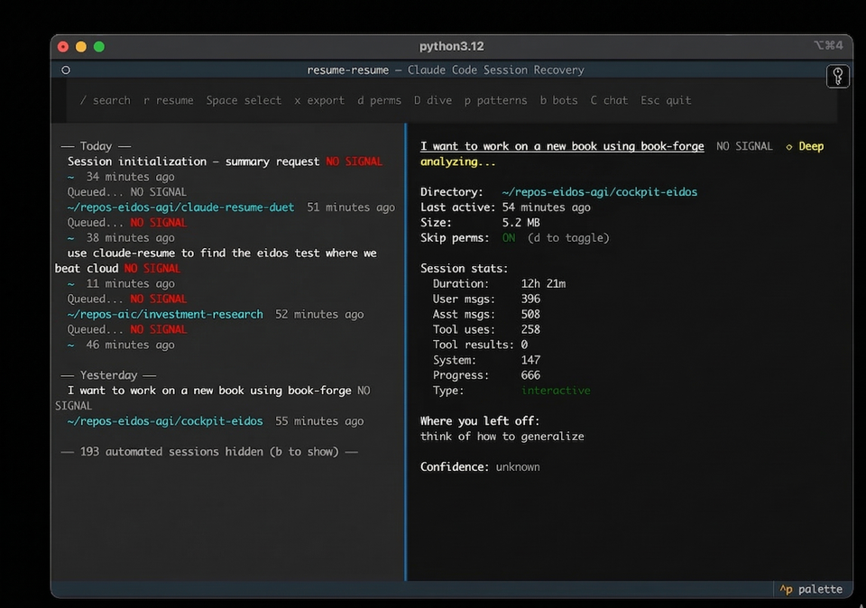

<p align="center">
  
</p>

# resume-resume

**New free tool we're dropping.**

| | |
|---|---|
| **Resume** | Ask Claude Resume to find old programming sessions in plain English, and pick up where you left off. |
| **Prioritize** | Claude Resume auto-ranks your past chats based on recency and incomplete worktrees, so you don't leave important work unfinished or uncommitted. |
| **Speed** | Claude Resume uses parallelized search to look through gigabytes of past chats in seconds. |
| **Cost Savings** | Claude Resume uses Haiku (smallest Claude model) to summarize past context once, then caches it permanently — so after the first run, searching thousands of sessions costs nothing. |
| **Merge** | Ask Claude Resume to merge multiple old chats together, pulling your thoughts across sessions into a single conversation. |

---

## MCP Server

Add it to Claude Code and every session on your machine can search, read, and merge your full session history — in plain English.

```bash
pip install resume-resume
claude mcp add resume-resume -- resume-resume-mcp
```

Or manually in your MCP config:

```json
{
  "mcpServers": {
    "resume-resume": {
      "command": "resume-resume-mcp"
    }
  }
}
```

We built **Eidos**, a multi-agent AI system. In [our benchmark](https://github.com/eidos-agi/cockpit-eidos), Eidos outperformed **Claude Opus 4.6** by **3.6x** in both accuracy and speed on complex tasks with 15+ reasoning chains. Below, we use Claude Resume to pick up where we left off across multiple sessions.

### Finding the benchmark where Eidos beat Claude Opus 4.6

> *"use resume-resume to find the eidos test where we beat claude"*


### Searching for a past session in plain English

> *"use resume-resume to find the latest chats about eidos philosophy docs"*


### Merging multiple past sessions into this chat

> *"use claude resume to merge march 14th conversations and Eidos v5 Pipeline Telemetry convo from march 11th into this chat"*


Two sessions — one about eidos-philosophy doc changes (Mar 14) and one with a full 28-task strategic plan (Mar 11) — merged into the current conversation with a single command.

### MCP Tools

| Tool | What it does |
|------|-------------|
| `boot_up(hours)` | Crash recovery — finds sessions that didn't exit cleanly, scored by urgency |
| `search_sessions(query)` | Full-text search across 5,000+ sessions in ~3s, ranked by RRF |
| `recent_sessions(hours)` | List recently active sessions |
| `read_session(id, keyword)` | Read actual messages from a session, with optional keyword filter |
| `session_summary(id)` | AI summary — cached instantly, generated in ~15s if not |
| `merge_context(id, mode)` | Import context from another session (`summary`, `messages`, or `hybrid`) |
| `session_timeline(id)` | Structured milestone timeline — file edits, commits, instructions |
| `session_thread(id)` | Follow continuation links across a multi-session thread |
| `resume_in_terminal(id)` | Open a session in a new terminal window (iTerm2 or Terminal.app) |
| `session_insights(section)` | Deep analytics across all sessions — patterns, personality, predictions |
| `session_xray(id)` | Single-session breakdown — duration, tokens, tool counts, branches |

---

## TUI

For when your machine died and you just need to get back to work.

```bash
pip install resume-resume
resume-resume        # last 4 hours
cr 24                # last 24 hours
cr --all             # everything
```



| Key | Action |
|-----|--------|
| `↑` `↓` | Navigate sessions |
| `r` | Resume directly — exec into the session |
| `Enter` | Copy resume command to clipboard |
| `Space` | Select for multi-resume (opens all in iTerm tabs) |
| `x` | Export context briefing as markdown |
| `/` | Search across all session content |
| `D` | Deep dive summary |
| `p` | Analyze prompting patterns |
| `b` | Toggle automated/bot sessions |

Requires Python 3.11+ and [Claude Code](https://docs.anthropic.com/en/docs/claude-code).

---

## How It Works

1. Scans `~/.claude/projects/` for JSONL session files
2. Scores each by interruption severity — crashed mid-tool-use sessions first, lifecycle-aware for bookmarked ones
3. Summarizes via `claude -p` with Haiku, cached permanently after first run
4. Classifies sessions as human or automated using a gradient boosting model trained on 3,800 sessions — bot sessions hidden by default
5. Surfaces bookmark data (lifecycle badges, next actions, blockers) when present

Run `/bookmark` inside any Claude Code session to capture lifecycle state (`done`, `paused`, `blocked`, `handoff`) before closing. An auto-bookmark Stop hook captures minimal state when you don't.

---

## Related

- [claude-session-commons](https://github.com/eidos-agi/claude-session-commons) — Shared session parsing, caching, and classification used by this repo and others
- [resume-resume-duet](https://github.com/eidos-agi/resume-resume-duet) — Web UI companion with session browser and `resume-resume://` URL scheme handler

## License

MIT
